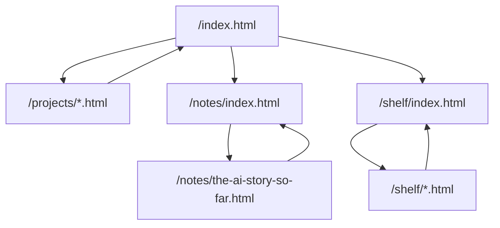
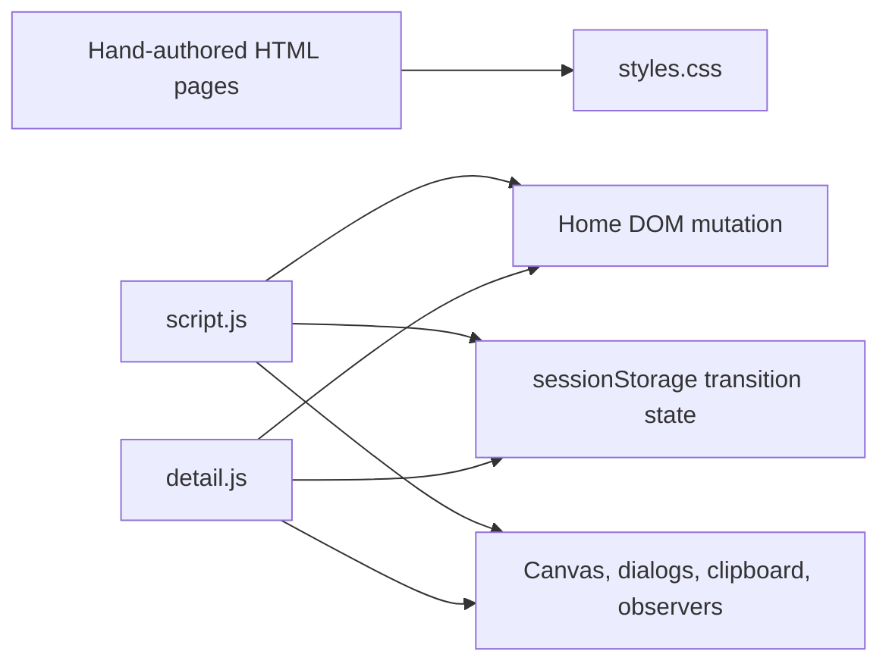

# Overview

## Scope

This repo is a dependency-free static portfolio site served from the repository root. It has one landing page, two archive index pages, and multiple hand-authored detail pages under `projects/`, `notes/`, and `shelf/`.

## Entry Points

- `index.html` renders the home page and loads `script.js`.
- `notes/index.html` renders the notes archive and loads `detail.js`.
- `shelf/index.html` renders the shelf archive and loads `detail.js`.
- `projects/*.html`, `notes/*.html`, and `shelf/*.html` render detail pages and load `detail.js`.
- `styles.css` is the single shared stylesheet for all pages.

## Route Map

## Runtime Shape

## Main Findings

- The site already behaves like a small content-driven app with a stable route structure.
- Home page card content is stored as JavaScript data in `script.js`, while long-form content is embedded directly in individual HTML files.
- Most subpages duplicate the same layout shell: header, transition overlay, footer, and script include.
- The home page contains the only substantial client-side behavior: canvas animation, section reveals, command dialog, copy-to-clipboard, and page-transition orchestration.
- Detail pages share only lightweight behavior: scroll progress, reveal-on-scroll, compact header state, and transition handoff.

## Migration Implication

This is a good fit for a Next.js migration because most effort is structural rather than algorithmic. The main work is:

- moving repeated HTML shells into shared React layout components
- converting JS-rendered card arrays into typed content modules or MD/MDX data
- deciding whether long-form detail pages stay as React page components or move into MDX/content collections
- porting the DOM-driven scripts into client components/hooks where browser APIs are used

See [site migration notes](/Users/luke/Documents/code/lmcjt/architecture/site/README.md).
